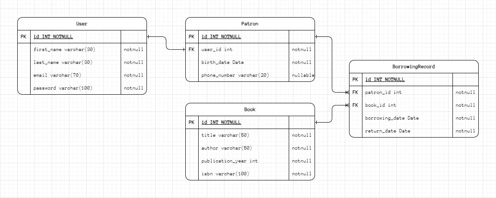

# Library Management System API

## Overview

This project is a Library Management System API built with Spring Boot. It allows librarians to manage books, patrons,
and borrowing records effectively.

## Features

- CRUD operations for Books, Patrons, and Borrowing Records.
- JWT-based Authentication for secure API access.
- Aspect-Oriented Programming (AOP) for logging method calls and exceptions.
- Spring Caching for improved performance.
- Comprehensive transaction management to ensure data integrity.
- Detailed API documentation and unit tests for reliability.

## Project Setup

1. **Clone the repository**:
   ```sh
   git clone https://github.com/alaazamelDev/library_management_system.git
   cd library-management-system
   ```

2. **Configure the database**:
    - Update the `application.yml` file with your database credentials.

3. **Build and run the project**:
   ```sh
   ./mvnw spring-boot:run
   ```

## Entities

| **Book**               | **Patron**             | **Borrowing Record**   | **User**               |
|------------------------|------------------------|------------------------|------------------------|
| ID                     | ID                     | ID                     | ID                     |
| Title                  | User ID (Foreign Key)  | Patron (Foreign Key)   | First Name             |
| Author                 | Phone Number           | Book (Foreign Key)     | Last Name              |
| Publication Year       | Birth Date             | Borrowing Date         | Email                  |
| ISBN                   |                        | Return Date            | Password               |

## API Endpoints

All endpoints are prefixed with `/api/v1`.

### Book Endpoints

- **GET /api/v1/books**: Retrieve a list of all books.
- **GET /api/v1/books/{id}**: Retrieve details of a specific book by ID.
- **POST /api/v1/books**: Add a new book to the library.
- **PUT /api/v1/books/{id}**: Update an existing book's information.
- **DELETE /api/v1/books/{id}**: Remove a book from the library.

### Patron Endpoints

- **GET /api/v1/patrons**: Retrieve a list of all patrons.
- **GET /api/v1/patrons/{id}**: Retrieve details of a specific patron by ID.
- **POST /api/v1/patrons**: Add a new patron to the system.
- **PUT /api/v1/patrons/{id}**: Update an existing patron's information.
- **DELETE /api/v1/patrons/{id}**: Remove a patron from the system.

### Borrowing Endpoints

- **POST /api/v1/borrow/{bookId}/patron/{patronId}**: Allow a patron to borrow a book.
- **PUT /api/v1/return/{bookId}/patron/{patronId}**: Record the return of a borrowed book by a patron.

## Validation and Error Handling

- Input validation using JSR-303 annotations.
- Global exception handling for graceful error responses.

## Security

- JWT-based authorization to protect API endpoints.

## Aspects

- AOP-based logging for method calls and exceptions.

## Caching

- Spring Cache for frequently accessed data.

## Transaction Management

- Declarative transaction management with `@Transactional`.

## Documentation

For detailed API documentation, please visit:

[API Documentation](https://documenter.getpostman.com/view/27792396/2sA3rzJCDW)

## ERD



## Additional Information

This project repository is public. Please refer to the documentation for detailed instructions on running the
application and interacting with API endpoints.

---

**Thank you for reviewing the Library Management System API!**
